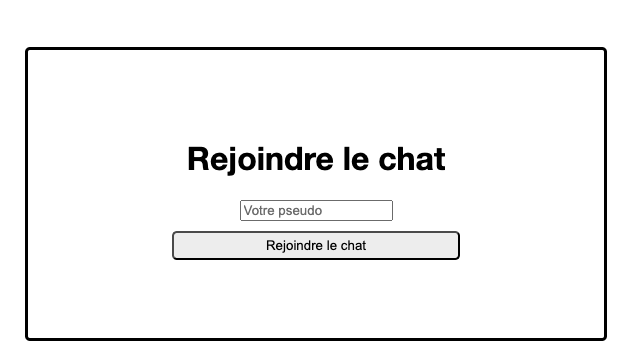
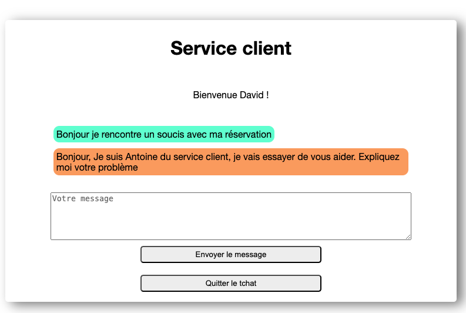
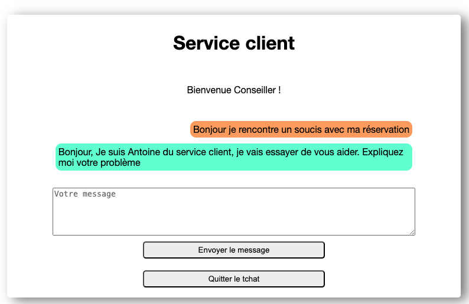

# Your Car Your Way – Chat PoC

This project is a proof of concept (PoC) for the Your Car Your Way application.
It implements a real-time chat between a customer and a support agent, demonstrating the technical feasibility of the synchronous communication feature required for the final application.

The backend is developed in Java with Spring Boot and uses WebSocket for real-time communication.
The frontend is built with Angular and simulates message sending and receiving.

## 🚀 Features

- A customer can send a message from the Angular interface.
- The support agent receives the message instantly through WebSocket.
- The agent can reply, and the customer sees the response in real time.
- Messages are displayed in a simple chat-style interface.


## ⚙️ How to Run the Application
There are two ways to start the application:


###  First Method: Docker (recommended)
1. Clone the repository 
2. From the project root, start the application with Docker Compose:
    ```
    docker-compose up 
    ```
3. Open your browser at:
    ```
   http://localhost:4200
   ```

## 🛠️ Prerequisites

- Docker (≥ 20.x)
- Docker Compose (≥ 2.x)

## Second Method: Manual Setup

## <ins>BACK-END</ins>

### 🛠️ Prerequisites

* Java 17
* Mysql 8.x.x
* IDE like Intellij / Eclipse

### Database :

* After installing mysql, and setting your username and password, make sure your database server is up and running.

* The database will be created when the backend is launched.

### Project setup :

* Open the project in your IDE. Open the application.properties file and edit the following lines:

```
#database
spring.datasource.url=jdbc:mysql://localhost:3306/chatdb?createDatabaseIfNotExist=true
spring.datasource.username=your_username
spring.datasource.password=your_password
```

### Run the backend

* In your terminal, go to the "back" folder and run :
  ```
  mvn spring-boot:run
  ```

## <ins>FRONT-END</ins>

### Prerequisites

* Node 20.x.x
* Angular 18.x.x
* IDE VS code / Sublime text

### Update Configuration
Update proxy.conf.json to forward API calls to your backend:
```
{
  "/api": {
    "target": "http://localhost:8080",
    "secure": false,
    "changeOrigin": true
  },
  "/ws-chat": {
    "target": "ws://localhost:8080",
    "ws": true
  }
}
```

### Run the project
* Open it in your IDE
* In your terminal place yourself in the "Front" directory
* install dependencies
    ```
    npm install
    ```
* start the development server
    ```
    ng serve
    ```
- Open your browser at:
    ```
    http://localhost:4200
    ```

## 📡 Usage

- Open a browser tab at http://localhost:4200 (customer). 
- Open a second tab in incognito mode at the same address (support agent). 
- Choose a username, send a message as the customer. 
- The support agent receives it instantly through WebSocket. 
- Replies appear in real time on the customer side.

## Screenshots


